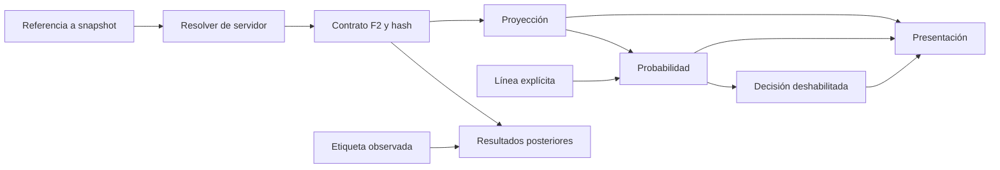

# Arquitectura predictiva v1 — Fase 3

Contrato externo: `prediction-chain-1`. Referencias: PRODUCT_SPEC y DATA_CONTRACT v1.0.0. No modifica sus definiciones ni demuestra precisión. Las fases 4–12 desarrollarán candidatos, evaluación, probabilidades, decisión y explicaciones.

## Cinco responsabilidades

| Etapa | Entrada | Salida | Prohibido |
|---|---|---|---|
| Proyección | Vector ordenado y artefacto compatible | Media de puntos NBA o par de ratings de tenis | Consultar cuotas, resultados del partido o decidir apuestas |
| Probabilidad | Proyección identificada, modelo de distribución y línea/periodo cuando corresponde | NBA OVER/UNDER/push; tenis A/B condicionado a finalización | Convertir FULL en Q1/HALF mediante un factor; sustituir distribución ausente |
| Decisión | Probabilidad y política habilitada | Actualmente abstención, pick/EV/stake nulos | Convertir una proyección o diferencia de puntos en pick desde el navegador |
| Presentación | Resultados de etapas | Copia inmutable y mensaje de estado | Recalcular probabilidad, EV, dispersión o combinación de selecciones |
| Resultados | Snapshot previo y etiqueta posterior compatible | Resultado separado con evento, periodo, corte y revisión | Reentrenar, volver a predecir, modificar el snapshot o tocar el bankroll |

La función orquestadora llama a etapas, no contiene sus matemáticas. Resultados tiene un punto de entrada posterior independiente. Ledger y liquidación personal existentes conservan su responsabilidad; su reconciliación corresponde a F13/F14.

Implementación: src/lib/prediction/{contracts,projection,probability,decision,presentation,results,capabilities}.js; orquestación en src/lib/server/prediction-pipeline.js; resolución en prediction-service.js; transporte separado en remote-projection.js. El presentador no importa motores. Resultados no importa proyección ni probabilidad. El modelo de puntos no recibe línea ni cuota.

## Qué está realmente habilitado

| Capacidad | Estado en esta rama |
|---|---|
| NBA FULL | Frontera preparada; ningún modelo/snapshot real registrado en el servicio público |
| NBA Q1/HALF | No soportados; sin escalado desde FULL |
| Servicio Python de puntos | `/v1/project` preparado; deshabilitado sin manifiesto y artefactos completos |
| Probabilidad NBA | Adaptador obligatorio; ningún calibrador/distribución real habilitado |
| Tenis individual | Ejemplo Elo únicamente con origen fixture; feed real v1 conserva contexto pero se abstiene de probabilidad |
| Recomendaciones comerciales | Deshabilitadas: sin pick, EV ni stake nuevo |
| Calculadora anterior | Retirada; reemplazada por estado de disponibilidad y enlaces al calendario/bankroll |
| Entrenamiento legacy | Sigue bloqueado por F2; modelos/CSV preservados |

El registro vacío es deliberado. No se inventa una fuente fiable, manifiesto aprobado o distribución para conservar cifras en pantalla. Una preview o despliegue web no activa el servicio Python ni su registro. La página de estado `/totales` es pública porque ya no contiene datos personales ni operaciones; POST predict/predict-batch mantienen identidad y permisos.

## Contrato y recorrido HTTP

POST `/api/predict` recibe `{version:'prediction-chain-1',snapshotId,market?}`. No recibe modelos, permisos de fixture, listas de proveedores confiables ni un snapshot declarado por el visitante. Propiedades desconocidas o formato antiguo producen 422 y abstención con código DATA_CONTRACT_REQUIRED. Una referencia válida todavía no resuelta produce SNAPSHOT_UNAVAILABLE; no una predicción vacía presentada como éxito del modelo.

El resolver autorizado de servidor debe recuperar los datos y configurar dataOptions. Su implementación actual no tiene fuentes reales registradas; las pruebas inyectan un resolver y modelos fixture desde código de test, nunca mediante HTTP. La carga debe conservar procedencia real antes de habilitarla en F18/F19. La cadena llama al contrato F2, sella el snapshot, construye el vector, verifica manifiestos, ejecuta las etapas y entrega contexto versionado.

POST `/api/predict-batch` recibe `{requests:[...]}` (1–15), exige Elite y cuota de uso, y llama al mismo servicio por elemento. El formato antiguo games/teamStats ya no ejecuta otro motor. GET `/api/predict` expone capacidades reales, sin claves o datos privados. Todas las respuestas llevan no-store. No se mantiene una caché de pronósticos parciales.

Las solicitudes antiguas no se convierten inventando ID/fechas. La generación desde `/picks` exige una referencia de snapshot; ante su ausencia muestra un motivo, no crea un pick a partir del histórico estático. No hay cálculo de EV ni umbrales comerciales en ese consumidor. Las funciones de agrupación/resumen de registros anteriores se conservan.

## Identidad y compatibilidad de etapas

Manifest de adaptador JS: schemaVersion, stage, id, artifactHash SHA-256, sport, period, dataContractVersion, featureRecipeVersion y validation. Proyección exige featureNames en el orden exacto. Probabilidad exige projectionModelId compatible. Fixture solo puede operar sobre origen fixture. Un manifiesto que diga validated sin validationReportId se rechaza; un texto de informe por sí solo no demuestra validación, que sigue siendo responsabilidad del registro controlado.

Cada salida de proyección/probabilidad conserva snapshotHash, eventId, period, asOf, modelId, artifactHash y validation. Los objetos se copian y congelan. Una salida incompatible, no finita, negativa o con campos inesperados se rechaza. Las probabilidades deben estar entre 0 y 1, sumar 1 e incluir push en NBA; una línea no entera no admite push. El test con una distribución controlada comprueba este contrato, no su plausibilidad deportiva.

Un fallo en proyección no dispara heurística ni otro modelo. Un fallo de distribución puede conservar la proyección como evidencia experimental, con probabilidad nula y abstención. El presentador no transforma ese punto estimado en confianza. El resultado posterior conserva su propio estado; no modifica las etapas previas.

## NBA: significado de cada cálculo

1. **Objetivo:** media esperada de puntos combinados al terminar FULL, incluidas prórrogas, conforme a F1. Las medias históricas de entrada son totales combinados, no puntos de un solo equipo.
2. **Candidato histórico:** la media aritmética de cuatro proyecciones (XGBoost, LightGBM, Ridge y MLP) queda implementada como adaptador experimental de puntos. No se declara mejor que Ridge. La comparación y selección corresponden a F4–F6.
3. **Artefacto:** el servicio Python exige projection-manifest.json, orden de las 26 variables, hashes de ensemble_model.json/lightgbm_totals.txt/calibration.json y dimensiones exactas. Ese manifiesto no se crea automáticamente. El hash del conjunto usa SHA-256 de los tres hashes concatenados en ese orden. No hay reemplazo LightGBM→XGBoost, carga alternativa del XGB antiguo ni padding/truncado de scaler, coeficientes o neuronas.
4. **Interfaz Python:** `/v1/project` recibe recibo de snapshot (hash/evento/periodo), versión/orden/valores de features y modelId; devuelve solo media e identidad del artefacto. Exige clave de servicio configurada y válida. Es una frontera entre servidores: el recibo no prueba por sí mismo procedencia; el servidor origen valida el snapshot. `/predict` y `/predict-batch` antiguos responden 410 después de autenticar. Health distingue disabled de ready.
5. **Línea:** entra explícitamente ligada al evento/periodo. No se fabrica desde la proyección ni se usa 220/110/55 por defecto. En F3 es un umbral de consulta, no una cuota de mercado certificada. La procedencia del precio y reglas de formato se impondrán en F8/F9/F18.
6. **Distribución:** la media no basta para obtener una probabilidad. F7 deberá aportar distribución/calibración por periodo con evidencia F5/F6. Para total discreto T y línea L: P(OVER)=P(T>L), P(UNDER)=P(T<L), P(push)=P(T=L). No se usa el meta-modelo histórico como sustituto ni una desviación fija para rellenar el hueco.
7. **EV:** definición F1, para cuota decimal d y stake unitario: P(win)(d−1)−P(loss); push devuelve el stake. No se calcula actualmente en el servicio, porque todavía faltan distribución/precio/política admisibles. No hay cuota -110/1,91 supuesta.
8. **Pick:** no se emite en F3. F9 exigirá precio, tiempo, modelo, validación y política versionada; una diferencia favorable en puntos nunca sustituye esas condiciones.

## Tenis: Elo y sus límites

src/lib/tennis/elo.js es dueño de actualización de ratings, función logística y elegibilidad. tennis/domain.js ordena y filtra el histórico, llama a esas funciones y añade contexto; no mezcla cuotas, stake ni resultados del partido a pronosticar.

- Inicio 1500; actualización K=24; esperado A=1/(1+10^((RB−RA)/400)). Actualización simultánea: delta=24(resultadoA−esperadoA), RA+=delta, RB−=delta. Se actualizan rating general y de la superficie disputada.
- Solo encuentros completos anteriores al corte y observados a tiempo, del grupo de circuitos masculino/femenino correspondiente. Se excluyen partido actual, futuros, retiros y walkovers. El histórico se ordena por finalización e ID.
- Rating de partido: 50% general + 50% superficie. Se aplica la misma logística al par mezclado. Es probabilidad de ganador condicionada a finalización sin retiro; no incorpora probabilidad de retiro ni regla de una casa.
- Elegibilidad heredada, aún no validada estadísticamente: programado y no iniciado; feed hasta seis horas; al menos 20 completos y 8 por superficie por jugador; último encuentro hasta 180 días; ninguna incidencia física activa reportada. Informe ausente no equivale a jugador sano.
- La demo pasa por el contrato F2 de ratings, recuentos, superficie y formato; sus timestamps derivados se etiquetan fixture, nunca observed. El feed real v1 no acredita toda la captura/revisión, por lo que se abstiene hasta un adaptador admisible. No se reconstruye procedencia inexistente.
- best_of queda explícito en el contrato, pero no cambia la fórmula actual. No se atribuye capacidad validada para diferencias de formato/circuito. Ranking/H2H/saque permanecen contexto. Calibración, sensibilidad K/mezcla/decay/mínimos, formato, circuito y comparación con referencias corresponden a F11 tras F5/F6. No se afirman mejoras por modularizar.

## Verificación y siguientes dependencias

Los tests cubren orden/dimensiones, hashes alterados, fallos de transporte, identidad equivocada, futuro/objetivo/periodo, distribución inválida, retiro, abstención, autenticación/plan/cuota y consumidor sin recálculo. Conservan las pruebas personales del ledger/seguimiento. Las expectativas antiguas que exigían fallback o EV en cliente se reemplazan por la conducta explícitamente retirada, no por mocks que finjan una validación real.

F4 prepara candidatos simples y complejos sin seleccionar ganador; F5/F6 comprobarán independencia/calibración y evidencia. F7 implementará distribuciones sustentadas; F8/F9 precio y decisión; F13/F14 resultados/ledger integrados; F16 operación completa; F17 diseño; F18/F19 fuentes reales. La arquitectura no es una prueba de rendimiento predictivo ni una finalización de esas fases.
